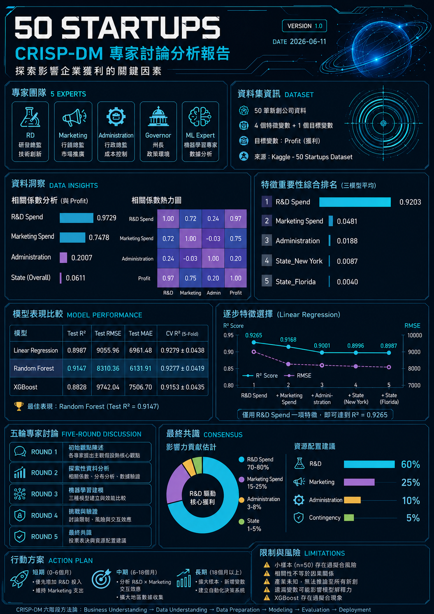
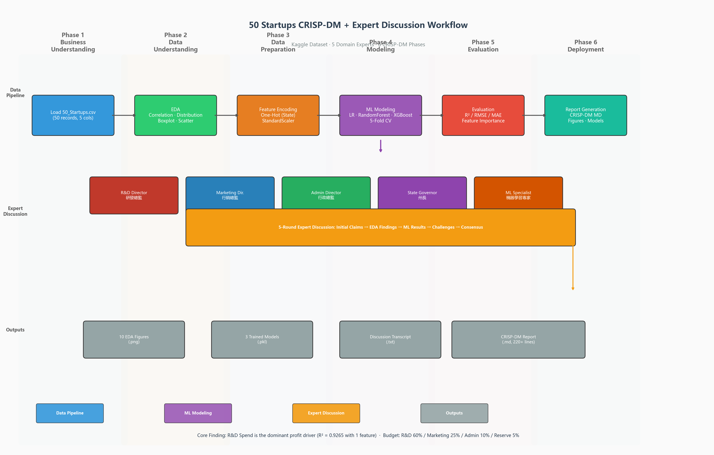

# 50 Startups — CRISP-DM 專家討論框架

> **Version**: 1.0  
> **Goal**: 以五位領域專家多輪討論結合 CRISP-DM 六階段方法論，分析 50 Startups 資料集，識別影響利潤（Profit）的主要驅動因素，並提出資源配置建議。

---





---

## 專案概述

本專案模擬 **五位領域專家** 進行 **五輪結構化討論**，從各自專業角度提出假設，結合探索性資料分析（EDA）與機器學習建模進行檢驗，最終達成共識。

### 五位專家角色

| 專家 | 角度 | 關注指標 |
|------|------|----------|
| 研發總監 | R&D 投入回報 | R&D Spend |
| 行銷總監 | 行銷支出效益 | Marketing Spend |
| 行政總監 | 營運效率 | Administration |
| 州長 | 地區政策影響 | State |
| 機器學習專家 | 綜合量化評估 | 所有特徵 |

### 五輪討論流程

| Round | 主題 | 重點 |
|-------|------|------|
| 1 | 初始觀點陳述 | 各專家提出主觀假設 |
| 2 | 探索性資料分析 (EDA) | 資料驗證假設 |
| 3 | 機器學習建模 | 三個模型量化特徵重要性 |
| 4 | 挑戰與驗證 | 討論限制、風險、交互效應 |
| 5 | 最終共識 | 投票表決與資源配置建議 |

---

## 目錄結構

```
├── config.yaml                  # 專案組態（專家角色、討論輪次、輸出路徑）
├── main.py                      # 主程式入口：串接完整 CRISP-DM 管線
├── generate_workflow.py         # 產生流程圖 workflow.png
├── requirements.txt             # Python 依賴
├── data/
│   └── 50_Startups.csv          # Kaggle 50 Startups 資料集
├── src/
│   ├── eda.py                   # 資料載入、探索性分析與視覺化
│   ├── modeling.py              # ML 建模（LR / RandomForest / XGBoost）
│   ├── discussion.py            # 五輪專家討論模擬
│   └── report.py                # CRISP-DM 六階段報告產生器
└── output/
    ├── CRISP_DM_Report.md       # 完整 CRISP-DM 報告（六階段）
    ├── discussion_transcript.txt # 專家討論逐字稿
    ├── workflow.png             # 流程圖
    ├── figures/                 # 11 張視覺化圖表（PNG）
    └── models/                  # 3 個已訓練模型（Pickle）
```

---

## 快速開始

### 環境需求

- Python >= 3.10

### 安裝

```bash
pip install -r requirements.txt
```

### 執行完整管線

```bash
python main.py
```

執行後將完成：
1. 載入並預處理 `50_Startups.csv`
2. 執行 EDA，在 `output/figures/` 生成 11 張圖表
3. 訓練 3 個機器學習模型，儲存至 `output/models/`
4. 模擬五輪專家討論
5. 輸出 `output/CRISP_DM_Report.md` 與 `output/discussion_transcript.txt`

### 僅生成流程圖

```bash
python generate_workflow.py
```

> 流程圖產生需要系統安裝中文字型（預設使用微軟雅黑 `msyh.ttc`），輸出 `output/workflow.png`。

---

## 技術棧

| 類別 | 工具 |
|------|------|
| **數據處理** | pandas, numpy |
| **視覺化** | matplotlib, seaborn |
| **機器學習** | scikit-learn, xgboost |
| **統計檢定** | scipy |
| **組態管理** | pyyaml |

### 使用的模型

- **Linear Regression**（含標準化係數詮釋）
- **Random Forest Regressor**（100 estimators）
- **XGBoost Regressor**（100 estimators）

### 評估方法

- 80/20 train-test split
- 5-Fold Cross-Validation（shuffled, random_state=42）
- StandardScaler 標準化
- 評估指標：R², RMSE, MAE
- 殘差分析（Q-Q Plot）

---

## 主要結果

| Model | Test R² | Test RMSE | CV R² (Mean ± Std) |
|-------|---------|-----------|---------------------|
| Linear Regression | 0.8987 | 9055.96 | 0.9279 ± 0.0438 |
| **Random Forest** | **0.9147** | **8310.36** | 0.9277 ± 0.0419 |
| XGBoost | 0.8828 | 9742.04 | 0.9153 ± 0.0435 |

### 特徵重要性排名

| Rank | 特徵 | 綜合重要性 |
|------|------|------------|
| 1 | R&D Spend | 0.9203 |
| 2 | Marketing Spend | 0.0481 |
| 3 | Administration | 0.0188 |
| 4 | State_New York | 0.0087 |
| 5 | State_Florida | 0.0040 |

### 核心結論

**R&D Spend 是利潤的首要驅動因子**（Pearson r = 0.9729；單特徵 Linear Regression 即達 R² = 0.9265）。建議資源配置比例：**R&D 60% / Marketing 25% / Administration 10% / Reserve 5%**。

---

## License

Academic / Educational Use Only.
